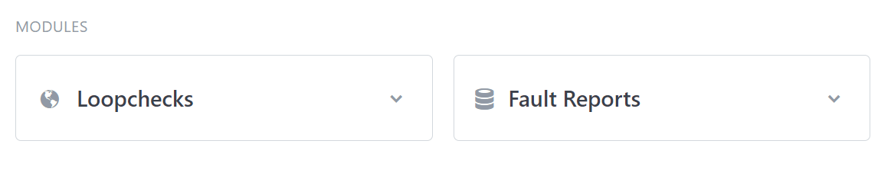
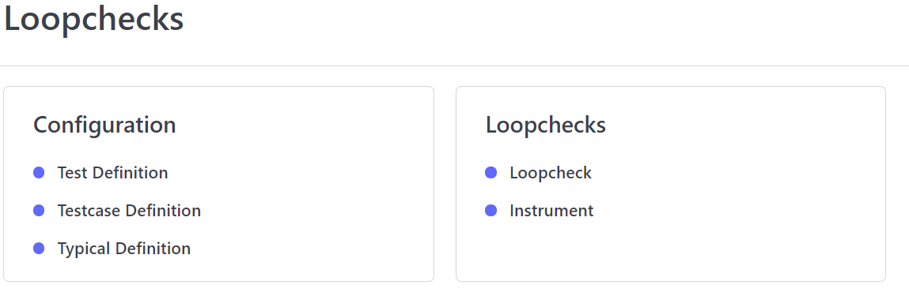
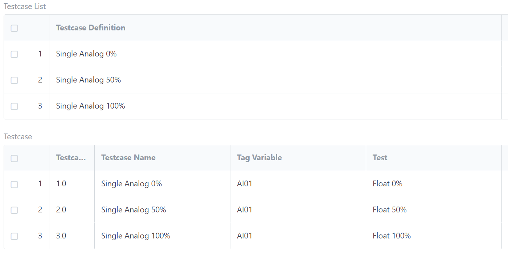

# Loopcheck Portal User Manual

Loopchcek Portal is used for executing and managing loopcheck testing.

## Getting Started

Loopcheck Portal consists of several modules.

1. Loopchecks
2. Fault Reports

Modules are shown on the top of the page.



## Loopchecks Module

Loopchecks Module consists of two parts

* Configuration
* Loopchecks



### Configuration

#### Test Definition
Firt part is to configure **Test Definitions**. This is done by opening **Test Definition** link.

Test Definition is used to define individual tests and their expected results. Those will be automatically inserted into loopcheck test. An example of Test Definition can be an analogue value, setpoint 50% of the instrument range with expected results 50% +- 2% deviation from the range. 

Let's create this in our example.

Test Definition document has the following fileds:

1. _Test Definition Name:_ Insert a Name that will be used for this speficic test. In our case, we will write **Float 50%**
2. _Setpoint:_ Setpoint is the value which tester has to set an instrument to. For example in analogue devices this would be 12mA for 50% of the range. We will specify this by writing **({range_high}-{range_low})\*0.5**
3. _Expected Result_: Expected Result is the value we expect to see. It is usually the same as the Setpoint, possibly with some deviation. In analogue measurements, it is not possible to set measurement to 50% of the range and measure exactly 50%, there will always be some deviation. So for this field, we will again type **({range_high}-{range_low})\*0.5**
4. _Deviation:_ If deviation is needed, this select this checkbox
5. _Deviation Value:_ Enter the deviation value as a number or a formula. If we want the deviation to be always 2% of the range of our instrument, we would enter **({range_high}-{range_low})\*0.2**

In the same way we will create Float 0% and Float 100% Test Definitions.

#### Testcase Definition

Testcases are used to bundle toghether the individual tests. Each Testcase can have one or more tests. Let's continue with our example for a single analogue value test.
In this case, we will create 3 Testcase Definition entries as follows.

1. For _Testcase Definition Name_ enter the name of the testcase, in our example we use **Single Analog 0%**
2. Next step is to click _Add Row_ button so we have exactly one row in the table. Let's now fill out all fiels in the row.
  1. _Tag Variable_ is will allow us to assign instrument signal to this specific row. For Testcases with only one row this doesn't seem important, but it is more obvious when we would have a analogue output valve with analogue input feedback. In that scenario, it is important to distinguish, which row holds test definiton for the valve itself and which for the feedback. In our example, let's write **AI01** into this field.
  2. _Test Description_ will show in the loopcheck to guide tester what has to be done. In our example, let's write **Modulate analog signal to 0% of the range (20mA)**
  3. _Test_ is the link field to all the **_Test Definition_** documents we have created. Start typing **Flo**, and select **Float 0%** from the dropdown.

Save and repeat the same process for 50% and 100%. So when we finish, we end up with 3 Testcase Definition documents.

#### Typical Definition

As a last step, we now have to combine our Testcases into one typical. Let's create a new typical.

1. For _Typical Definition Name_ enter the name of this typical. This will be a reference in _Instrument List_. In our example let's type **Typ_AI_01**
2. Next step is to add 3 rows in _Testcase List_ table and add our testcases.

Now the document should look like this:



Congratulations, your first configuration is finished.

In the next steps, let's have a look into [our second module.](loopchecks.md)

You can use the [editor on GitHub](https://github.com/Synelecs-GmbH/Synelecs-GmbH.github.io/edit/main/README.md) to maintain and preview the content for your website in Markdown files.

Whenever you commit to this repository, GitHub Pages will run [Jekyll](https://jekyllrb.com/) to rebuild the pages in your site, from the content in your Markdown files.

### Markdown

Markdown is a lightweight and easy-to-use syntax for styling your writing. It includes conventions for

```markdown
Syntax highlighted code block

# Header 1
## Header 2
### Header 3

- Bulleted
- List

1. Numbered
2. List

**Bold** and _Italic_ and `Code` text

[Link](url) and 
```

For more details see [GitHub Flavored Markdown](https://guides.github.com/features/mastering-markdown/).

### Jekyll Themes

Your Pages site will use the layout and styles from the Jekyll theme you have selected in your [repository settings](https://github.com/Synelecs-GmbH/Synelecs-GmbH.github.io/settings). The name of this theme is saved in the Jekyll `_config.yml` configuration file.

### Support or Contact

Having trouble with Pages? Check out our [documentation](https://docs.github.com/categories/github-pages-basics/) or [contact support](https://support.github.com/contact) and we’ll help you sort it out.
