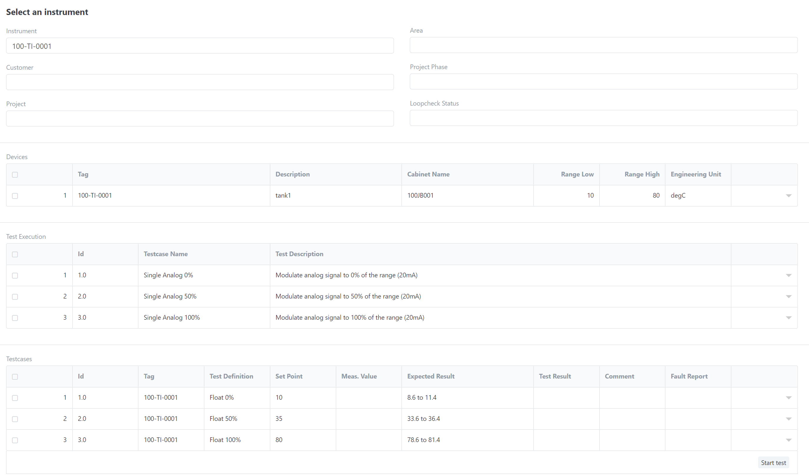

## Loopchecks Module
Loopchecks Module consists of two documents
1. Loopcheck
2. Instrument

### Instrument

Instrument is a collection of one or more signals that belong to a typical, in our example typical **Typ_AI_01**.
Let's create a new instrument for a tempareture measurement, e.g. 100-TI-0001

Fill out the form as follows:

1. _Instrument Name:_ 100-TI-0001 (that is the name of our instrument)
2. _Typical Definition:_ select **_TYP_AI_01_** from the dropdown.
3. _Signal_ table is automatically created with one row and the variable _AI01_. This is the variable we defined in Testcase definition.
4. Fill out the rest of the table:
  1. _Tag:_ in this case, we can use the same as instrument name, as we only have one signal
  2. Enter _Description:, Cabinet Name, Low/High Range_ and _Engineering Units_.

That concludes our first instrument setup.

### Loopcheck

Loopcheck is the final part of this module. This is where we test our instrument. To create new loopcheck, we need to first assign one instrument to it.
This is done very easily, just select _**Instrument**_ from the dropdown menu, or start typing and the filter will automatically select the corresponding signals for you.

So let's select **100-TI-0001**
The rest of the information will be automatically fetched and you should see something like this:

#### Loopcheck Test

To perform loopcheck test, start by cliking on button _Start Test_ in the right bottom corner.
First test will be highlighted. If OPC UA is active, live data will be presented. Otherwise, enter manual value into _Meas Value_ field. If _Meas Value_ is between expected results, Test Result will be **PASS**, otherwise **FAIL**
When first test is finished, click on _Next_ button to continue testing until end of all tests.

In case there are FAILed items, create _Fault Report_. This can be done directly in the Testcases table against failed test. When test is concluded, write PASS/FAIL into Test Result and click Save. 

Save button will then change to _Actions_. Click _Actions_ -> _For Review_. Workflow status of the loopcheck will change from _Saved_ to _For Approval_. 
_Tested By_ and _Date Tested_ are automatically filled in.

Witness has now option either to Approve or Reject the results. When he _Rejects_ the loopcheck, user has the option to retest the loopcheck and send it again for approval.
Once the witness selects _Approve_, loopcheck will be submitted and can't be changed anymore. Also, in this step, fields _Witnessed By_ and _Date Witnessed_ are automatically entered.
